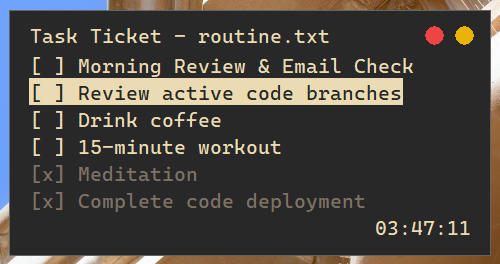

# 📝 Task Ticket - Daily routine

Ultra-lean and Ultra-simple Win32 desktop application for daily routines and task ticketing.

<br>
*Please don't mind that is almost 4AM in the screeenshot.*


## Why Task Ticket?
Most modern task trackers are built on heavy web frameworks that bloat file sizes and hog system resources. Task Ticket is built as a pure, single-purpose desktop application, written in native C++ with no external dependencies. It sits quietly on your screen to help define your day.

## Features
* **Native Performance:** Written in pure Win32/C++ for maximum execution speed.
* **Ultra-Low Overhead:** Highly optimized event loop operating at ~0.2% CPU usage when idle.
* **Text-Based Interface:** Features a high-contrast, terminal-inspired aesthetic for focus.
* **Dynamic Content-Aware Sizing:** The application window automatically shrinks or expands vertically to perfectly fit your current task list—zero wasted screen real estate.
* **Heads-Up Display Mode:** Fixed to **Always-on-Top** with a distraction-free, borderless aesthetic so your routine stays visible while you work.
* **Fluid Window Management:** Click and drag the title bar on the interface to seamlessly reposition the window on your desktop.
* **Integrated Precision Clock:** Features a lightweight, live-updating clock in the corner to help pace your daily routines.
* **Plain Text Backend:** Reads and writes routines straight to local text files.
* **Drag-and-Drop Support:** Open any routine ticket instantly by dragging a file directly into the interface.

## Requirements
* **OS:** Windows 10 or Windows 11 (64-bit)
* **Compiler:** Visual Studio (MSVC) with C++ Desktop Development workload

## How to use

### Create a routine
Task Ticket reads your daily routine straight from a plain text file (`.txt`).<br>
You can create multiple files for different routines and instantly load them by **dragging and dropping** the file anywhere onto the application window.

To create a routine file, just list your tasks line-per-line in a text file.
### Example format:
```txt
Morning Review & Email Check
Review active code branches
Complete code deployment
Drink coffee
Meditation
15-minute workout
```

### Controls & Shortcuts
- **Up / Down Arrows:** Navigate through the task list.
- **Enter:** Toggle the selected task between complete `[x]` and incomplete `[ ]`.
- **Mouse Drag:** Click and hold the title bar of the window to move it around your screen.
- **Red Button (Top Right):** Close the application.
- **Orange Button (Top Right):** Minimize the window.

## Building from Source
1. Clone the repository.
2. Open the `.sln` solution file in Visual Studio.
3. Set the build configuration to **Release**.
4. Press `Ctrl + Shift + B` to compile the standalone executable.

## License
This project is licensed under the **GNU General Public License v3 (GPLv3)**. See the `LICENSE` file for details.